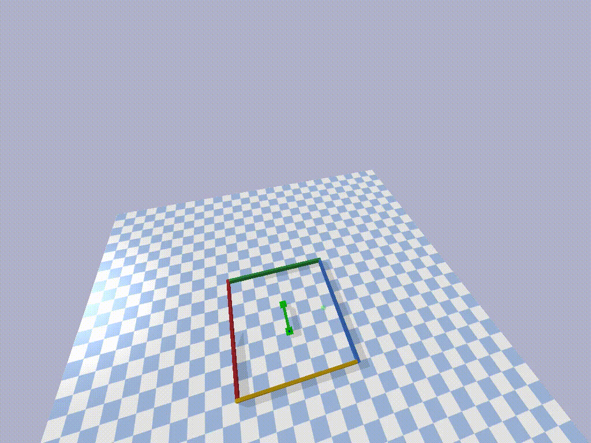
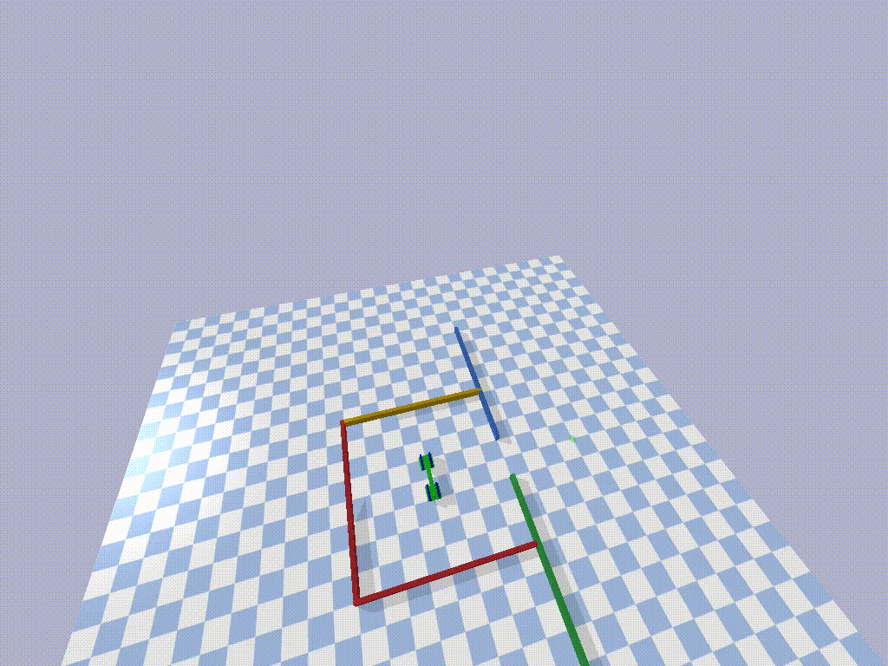

## Multirobot Payload Transport with Deep Reinforcement Learning 

In this project several centralized and decentralized methods for Multirobot Payload transport are explored there are two scenarios for the robots, A closed space with a target and a narrow passage way for the robots to carry payload to. The algorithms experimented are  

- Cenralized: 
	- Proximal Policy Optimization(PPO)
	- Deep Determinstic Policy Gradients(DDPG)
	- Evolution Guided Policy Gradients[PPO-ERL](https://arxiv.org/pdf/1805.07917.pdf) 

- Distributed : 
	- MAPPO
	- MADDPG
	- Neurocoevolution
		- Hall Of Fame
		

### Demo: 
- Evolutionary methods NES: 
	
- PPO: 
	
- PPO-ERL: 
	

The code can be found in the "examples" directory, Go ahead and explore all the methods you can find here! 

Project simulation is in PyBullet environment and depends on [Generic URDF robots](https://github.com/maxspahn/gym_envs_urdf/) and I'm very thankful to Max Spahn for his prompt responses and help in building the simulation environment
